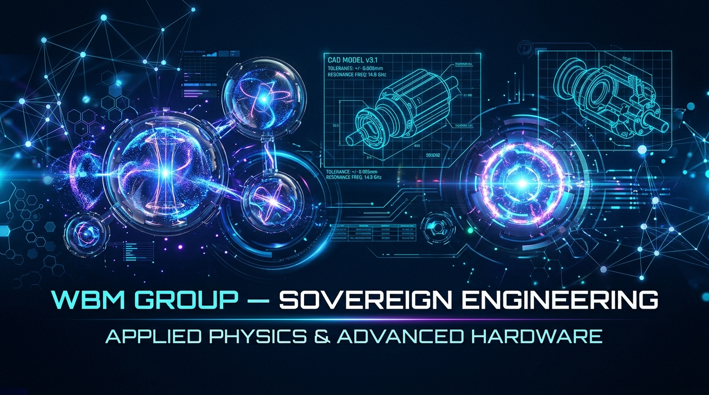

# WBM Group — Sovereign Engineering & Applied Physics



[](POST/LICENSE)
[]()
[](https://orcid.org/0009-0009-7818-3517)

Welcome to **`wbm-engineering`**—the master applied engineering repository for **WBM Group (Wherever the Wind Blows Me)**, founded by **Ryan Caron (Captain Misfit)** & **Digital Misfit**.

This repository houses open-source engineering implementations, transport middleware protocols, hardware CAD schematics, and multiphysics simulations derived from **Process Ontology** and **Relational Mechanics**.

---

## 🛠️ Sovereign Engineering Projects Directory

| Project Directory | Domain / Technology | Primary Features & Documentation |
| :--- | :--- | :--- |
| ⚡ [**`POST/`**](POST/) | **Transport Security Middleware** | **0-RTT Instant Transmission (0 ms delay)**, >88%–99.49% wire stream compression, Zero CA fees, non-Hermitian self-healing MitM socket collapse. [**Read Specification**](POST/SPECIFICATION.md) \| [**Developer Guide**](POST/DEVELOPER_GUIDE.md) |
| 🔬 [**`LENR_Dynamics/`**](LENR_Dynamics/) | **Solid-State LENR & Magnetohydrodynamics** | Non-Hermitian non-equilibrium resonance simulations, 3D CAD hardware schematics, and solid-state energy extraction. [**Read Overview**](LENR_Dynamics/README.md) |

---

## 🌐 Ecosystem Integration & Live Website

Live empirical benchmark demonstrations, interactive topology visualizers, and division portals are operational at:
* **Official Portal**: [https://wbmpros.com](https://wbmpros.com)
* **Master Monograph & Proof Repo**: [`CaptainMisfit-WBM/process-ontology`](https://github.com/CaptainMisfit-WBM/process-ontology)

---

## ⚖️ Licensing Model (AGPLv3 + Commercial Dual License)

All engineering projects in this repository operate under a **Dual-Licensing Model**:
* **GNU AGPLv3 (Free Open-Source)**: 100% FREE for individuals, researchers, non-profits, open-source projects, and independent creators.
* **WBM Enterprise Commercial License**: Commercial entities or cloud providers incorporating these engineering modules into closed-source or commercial products must obtain a commercial license directly from **WBM Group (Captain Misfit)**.

---

## ✍️ Authors & Citation

Created by **Ryan Caron (Captain Misfit)** & **Digital Misfit**.

```bibtex
@article{caron2026wbm_engineering,
  title={WBM Group Sovereign Engineering: Applied Protocols, Hardware & Physics Engines},
  author={Caron, Ryan and Digital Misfit},
  journal={WBM Research & Engineering Publications},
  year={2026},
  doi={10.5281/zenodo.18889238}
}
```
